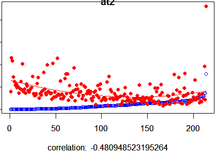

Introduction
------------

This is a library created as a package in Language R. Its purpose is to
classify text documents. The application's Intelligence can perceive the
subject being discussed in the texts and evaluate the distance to other
documents.

Distance from documents is a metric based on Zipf's Law, an empirical
law formulated using mathematical statistics that refers to the fact
that many types of data studied in the physical and social sciences can
be approximated with a Zipfian distribution, one of a family of related
discrete power law probability distributions. The law is named after the
American linguist George Kingsley Zipf (1902–1950), who popularized it
and sought to explain it (Zipf 1935, 1949), though he did not claim to
have originated it.\[1\] The French stenographer Jean-Baptiste Estoup
(1868–1950) appears to have noticed the regularity before Zipf. It was
also noted in 1913 by German physicist Felix Auerbach (1856–1933).

The simplicity of the algorithm is its great attraction. Speed is a
consequence of this simplicity and lightness. Zipf's law suite provides
collection, extraction, cleanup, transformation, and text classification
features. It extends the concept of distance, such as the Euclidean and
Manhattan distances, as the distance Erlei from Zipf.

After transforming the words (terms) of the text into TF-IDF metrics,
the algorithm creates sparse vectors to calculate the distances by the
Zipf's Law.

The Dataset
-----------

The "Tribuna" database is of journalistic origin with its digital
publication, a factor that may be important for professionals of the
area, also serving to understand other similar datasets. In order to
carry out the experiment, we adopted the "A Tribuna" database, whose
main characteristics presented previously, show that the collection is a
good source of research, since it is already classified by specialists
and has 21 classes that can be Displayed in the table below.

The Research
------------

Today hundreds of journalistic documents are published daily on the
Internet. Experts strive to develop techniques that can improve
performance in the classification and understanding of the texts of the
published documents.

We have tried to automatically classify the journalistic classes of A
Tribuna. There are 21 classes that are shown graphically below.

### About Class and its DNA

These are the classes and their Chromosome. This was extracted through
the Vector Model with the Terms Frequency and the Inverse Document
Frequency metrics (TF-IDF).

### Comparing Files

Let's compare an AT2 Class file with AT2 Class Chromosome.

Let's compare an BRO Class file with AT2 Class Chromosome.

This small attempt demonstrates that the class chromosome can
statistically classify the inferred files to the algorithm.

### Conclusion

Soon the full results will be released with the published scientific
article.

  [The Scientist](http://www.thescientist.com.br)   
